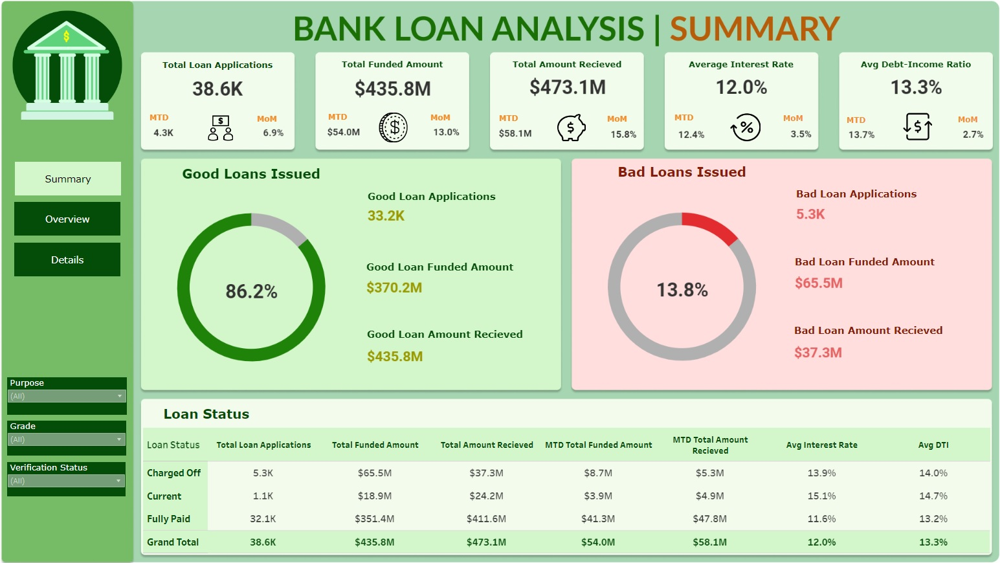
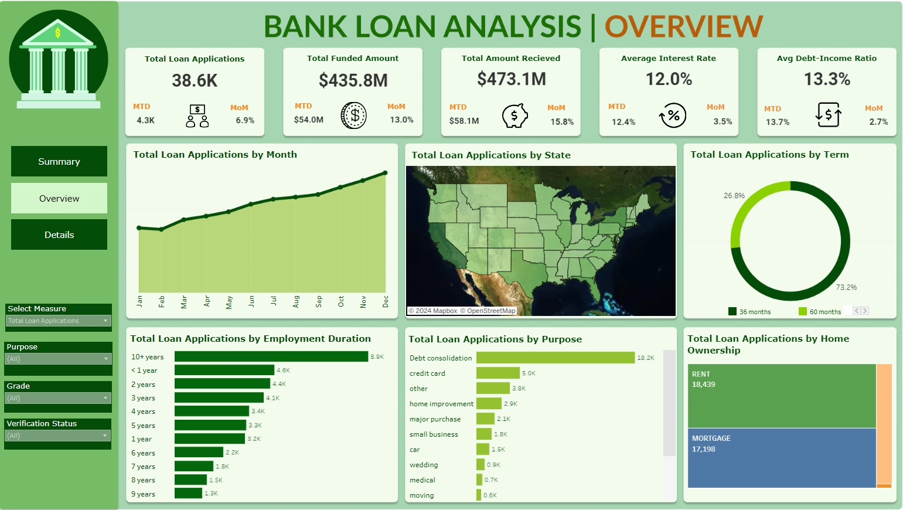
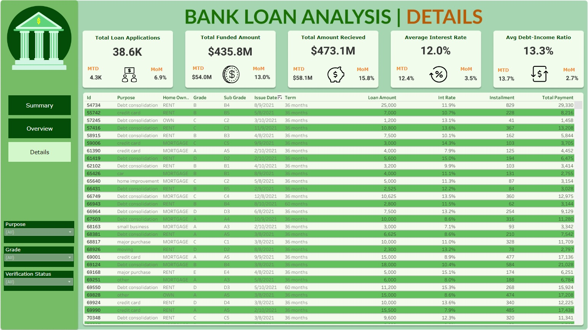

# Bank Loan Analysis Project
Welcome to the Bank Loan Analysis project repository. This project aims to provide a comprehensive analysis of loan data to support data-driven decision-making in the banking sector. 

<a href="https://public.tableau.com/app/profile/prithu.sharma/viz/BankLoanAnalysisDashboard_17087961778120/Summary">View Fully Interactive Dashboard</a>

## Project Overview
This project focuses on analyzing loan trends, regional loan analysis, employment duration analysis, and distinguishing between good loans and bad loans. The dataset used contains detailed loan information for the year 2021, with a total of 38576 rows and 24 columns.

## Problem Statement
The primary challenge addressed in this project is the lack of a centralized loan monitoring system, hindering the evaluation of loan metrics and trends. By developing a comprehensive reporting system and identifying key performance indicators, we aim to enable data-driven decision-making processes such as loan approvals and risk assessment.

## Key Objectives
- Conduct profitability analysis by examining interest income and loan quality.
- Develop a reporting system highlighting key loan metrics and trends.
- Generate interactive dashboards showcasing KPIs, monthly loan trends, regional analysis, loan term analysis, and more.

## Analysis Highlights
- **Monthly Loan Trends:** The analysis reveals a positive overall monthly trend, with increases in total loan applications and funded amounts.
- **Regional Loan Analysis:** Insights into loan distribution across different states, with California leading in loan applications and funded amounts.
- **Employment Duration Analysis:** Majority of loan applications are from individuals employed over 10 years, indicating financial stability.
- **Loan Purpose Analysis:** Debt consolidation emerges as the primary loan purpose, followed by credit card repayments and home improvement.

## Loan Portfolio Management
- **Differentiating Good Loans vs. Bad Loans:** Implementing specific loan criteria to identify potential credit risks and improve risk mitigation strategies.
- **Loan Portfolio Health Assessment:** Tracking key metrics like Total Loan Applications and Funded Amount to identify risks and opportunities for improvement.
- **Regional Expansion:** Utilizing regional loan analysis to identify areas for potential branch expansion or targeted marketing efforts.
- **Improving Repayment Rates:** Analyzing bad loan metrics and borrower profiles to implement strategies for preventing defaults.
- **Targeting High Performing Loan Applicants:** Developing targeted marketing campaigns based on financial health indicators.

## Screenshots from the Dashboard

## Conclusion
This project aims to provide valuable insights into loan management and risk assessment, leveraging data analysis to enhance decision-making processes in the banking sector.

Thank you for visiting our project repository. Feel free to explore the detailed analysis and dashboard snapshots provided.
